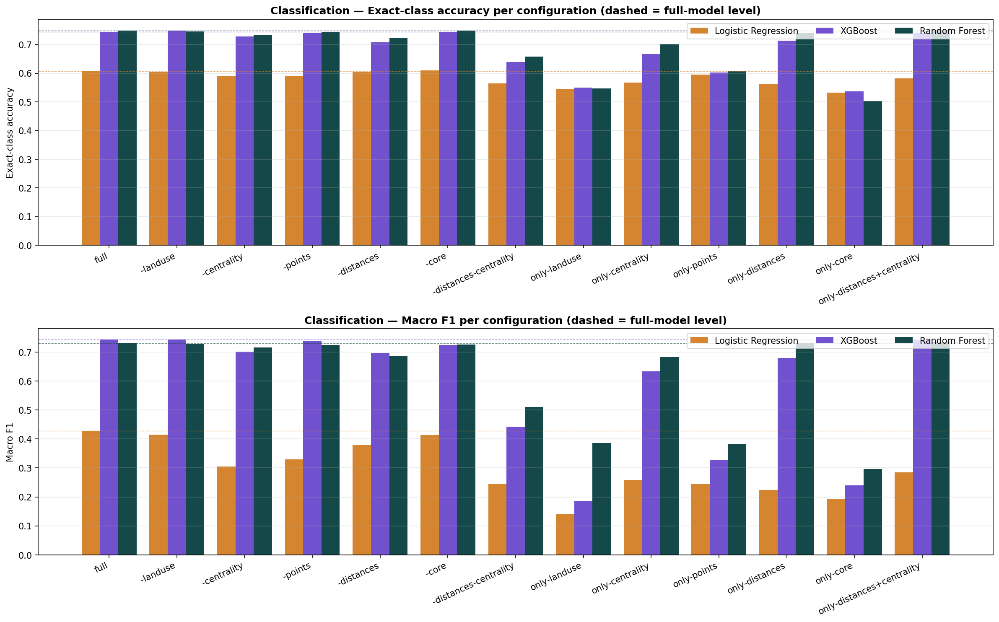
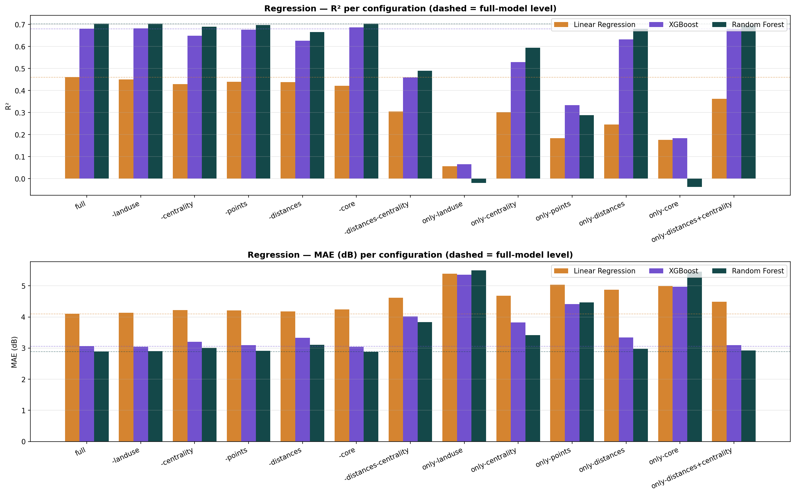
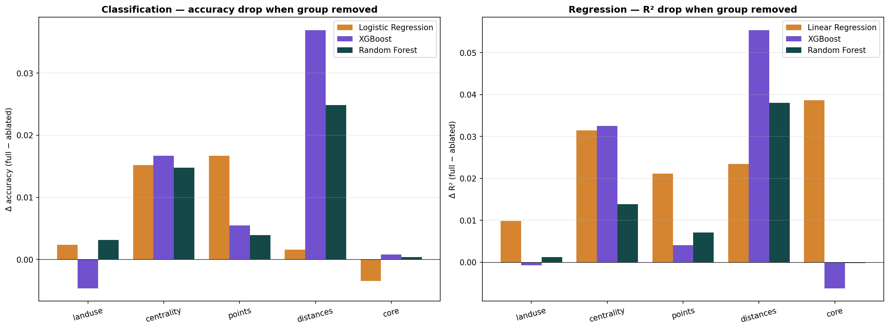
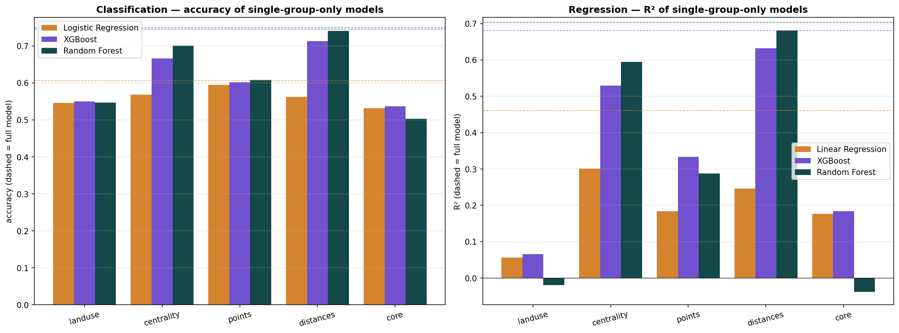
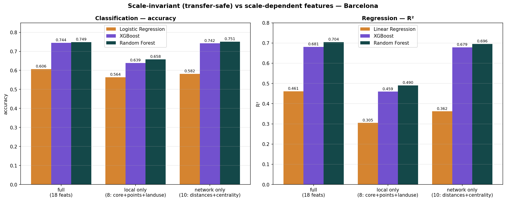

# Barcelona feature-ablation study

**Date:** 2026-06-13
**Scope:** Barcelona only (held-out 20% test set) — no city transfer.
**Notebooks:** `ablation_study/notebooks/ablation_classification.ipynb`, `ablation_study/notebooks/ablation_regression.ipynb`
**Data:** `notebooks/_elena/data/bcn_noise_{class,regre}_ml_dataset.csv` (12,854 segments, target **`noise_day`**).

## What this measures

The Barcelona models use **18 features**. This study removes them one thematic group at a time
(and uses each group alone) to answer: *which feature groups does the model actually rely on, and
how much would we lose by dropping each?* Every configuration is retrained from scratch with a
fresh `StandardScaler` and the **same** `train_test_split(test_size=0.2, random_state=42)`, so all
numbers are directly comparable. Models are exactly those of `07_SL_save_model_*` (LogReg
`max_iter=2000`, XGBoost defaults, RandomForest `random_state=42`).

### The 5 feature groups

| Group | Features | n |
|---|---|---|
| `core` | road_category, width | 2 |
| `distances` | dist_to_{trunk, primary, secondary, tertiary, residential, living_street} | 6 |
| `points` | signals, transport, pois | 3 |
| `centrality` | betweenness, closeness_global, closeness_400, straightness | 4 |
| `landuse` | green, industrial, commercial | 3 |

### The 13 configurations (per task, per model)

`full` (all 18) · **leave-one-out** `−landuse −centrality −points −distances −core` · **single-group-only** `only-landuse only-centrality only-points only-distances only-core` · **combined** `−distances−centrality` (the 8 *local / scale-invariant* features) and `only-distances+centrality` (the 10 *network-scale-dependent* features).

The combined pair targets the two groups that go out-of-distribution across cities (see
[the transfer report](../deployment/BCN_MODEL_TRANSFER_REPORT.md)) — the "Scale-invariant vs
scale-dependent" section below uses them to weigh signal against transferability.

The `full` row reproduces the published baselines exactly (LogReg 0.606 / XGB 0.744 / RF 0.749
accuracy; LinReg 0.461 / XGB 0.681 / RF 0.704 R²), confirming the harness is sound.

---

## Results — classification (`noise_day` class, accuracy)

| Config | LogReg | XGBoost | RF | | Config | LogReg | XGBoost | RF |
|---|---|---|---|---|---|---|---|---|
| **full** | **0.606** | **0.744** | **0.749** | | | | | |
| −landuse | 0.604 | 0.749 | 0.746 | | only-landuse | 0.546 | 0.550 | 0.547 |
| −centrality | 0.591 | 0.728 | 0.734 | | only-centrality | 0.568 | 0.666 | 0.701 |
| −points | 0.590 | 0.739 | 0.745 | | only-points | 0.595 | 0.602 | 0.608 |
| −distances | 0.605 | 0.708 | 0.724 | | only-distances | 0.562 | 0.713 | **0.740** |
| −core | 0.610 | 0.744 | 0.748 | | only-core | 0.532 | 0.537 | 0.503 |
| **−dist−centr** (8 local) | 0.564 | 0.639 | 0.658 | | **only-dist+centr** (10 net.) | 0.582 | 0.742 | **0.751** |

Macro F1 and within-±1-class follow the same ranking; within ±1 stays 0.98–0.99 for every full/leave-out
config and never drops below 0.92 even for the weakest single-group model (full tables in the result CSV).

## Results — regression (`noise_day` dB, R²)

| Config | LinReg | XGBoost | RF | | Config | LinReg | XGBoost | RF |
|---|---|---|---|---|---|---|---|---|
| **full** | **0.461** | **0.681** | **0.704** | | | | | |
| −landuse | 0.451 | 0.682 | 0.703 | | only-landuse | 0.056 | 0.066 | −0.020 |
| −centrality | 0.430 | 0.649 | 0.690 | | only-centrality | 0.301 | 0.530 | 0.595 |
| −points | 0.440 | 0.677 | 0.697 | | only-points | 0.184 | 0.334 | 0.288 |
| −distances | 0.438 | 0.626 | 0.666 | | only-distances | 0.246 | 0.632 | **0.681** |
| −core | 0.422 | 0.687 | 0.704 | | only-core | 0.176 | 0.184 | −0.038 |
| **−dist−centr** (8 local) | 0.305 | 0.459 | 0.490 | | **only-dist+centr** (10 net.) | 0.362 | 0.679 | **0.696** |

MAE (dB) mirrors R²: full = LinReg 4.10 / XGB 3.07 / RF 2.89; the worst leave-out (−distances) is
LinReg 4.18 / XGB 3.33 / RF 3.10; single-group MAE ranges 2.98 (RF only-distances) to 5.50 (RF only-landuse).

---

## Diagrams

### Metrics per configuration

*Bars = the three models; dashed lines = the full-model level. The full bar and the five leave-one-out
bars sit almost on the dashed line — removing any single group barely moves the metric. The single-group
bars on the right fan out, exposing how unequal the groups are on their own.*

### Leave-one-group-out importance — how much is lost when a group is removed

*Δ = full − ablated (taller = the model relies on that group more). **`distances` is the tallest bar for
both tree models in both tasks**; `centrality` is second; `landuse`, `points` and `core` are near zero.
The one striking exception is the orange bar at far right of the regression panel: removing `core`
costs Linear Regression 0.039 R² — see below.*

### Single-group-only standalone power — how well each group predicts alone

*Dashed line = full model. **`only-distances` (Random Forest) reaches 0.740 accuracy / 0.681 R² — within
0.01–0.02 of the full 18-feature model.** `only-centrality` is a solid second; `only-points`,
`only-landuse` and `only-core` are weak on their own.*

### Scale-invariant vs scale-dependent features — the transfer tension

`distances` and `centrality` are exactly the two groups that go **out-of-distribution when the model
is transferred to another city** — they are functions of network size and urban fabric (the transfer
report measures Viladecans closeness at 22σ, Berlin `dist_to_trunk` at 15σ, Zaragoza `dist_to_tertiary`
at 4.7σ under the Barcelona scaler). This chart splits the features into the **network-scale** set
(those two groups, 10 features) and the **local / scale-invariant** set (`core + points + landuse`,
8 features) and trains on each alone.

| Config | n features | LogReg / LinReg | XGBoost | RF | RF Δ vs full |
|---|---|---|---|---|---|
| **full** | 18 | 0.606 / 0.461 | 0.744 / 0.681 | **0.749 / 0.704** | — |
| network only (`only-dist+centr`) | 10 | 0.582 / 0.362 | 0.742 / 0.679 | **0.751 / 0.696** | **+0.002 / −0.008** |
| local only (`−dist−centr`) | 8 | 0.564 / 0.305 | 0.639 / 0.459 | 0.658 / 0.490 | **−0.091 / −0.214** |

*(each model cell is `classification accuracy / regression R²`; the last column is the Random Forest change vs the full model.)*

**The network-scale features alone reproduce essentially the entire full model** — Random Forest on
just the 10 distance+centrality features scores **0.751 accuracy / 0.696 R²**, matching the full
18-feature model (0.749 / 0.704). The **local / scale-invariant features alone fall well short**:
0.658 / 0.490 (RF), i.e. **−0.09 accuracy and −0.21 R²** below full.

This is the **central tension of the whole transfer project, made quantitative**: the signal Barcelona's
model learns lives almost entirely in `distances` + `centrality` — and those are precisely the features
that break under covariate shift in Berlin, Zaragoza, Viladecans. A model restricted to the transfer-safe
*local* features would not suffer that shift, but it starts from a materially weaker Barcelona ceiling
(0.49 vs 0.70 R²). There is no free lunch: **the features that carry the noise signal are the ones that
don't travel.**

---

## Interpretation

**1. The feature set is highly redundant.** Dropping any one of the five groups costs at most **0.036
accuracy** (XGBoost, −distances) and **0.055 R²** (XGBoost, −distances); most drops are under 0.01. No
single group is indispensable, because the groups carry overlapping information about the same
underlying thing — where a street sits in the road hierarchy.

**2. `distances` is the dominant group.** The six `dist_to_<category>` features are consistently the
most important: removing them produces the largest drop for both tree models in both tasks, and **alone
they nearly reproduce the full model** (RF `only-distances`: 0.740 vs 0.749 accuracy; 0.681 vs 0.704 R²).
This makes sense — distance to the nearest trunk/primary/secondary road is a direct proxy for "how big
is the road I'm on / next to", which is what drives traffic noise. The trees recover almost the entire
signal from this group.

**3. `centrality` is the clear second.** Betweenness/closeness/straightness removal costs ~0.015
accuracy and 0.014–0.032 R²; `only-centrality` reaches 0.595 R² (RF). Centrality encodes how much
through-traffic a street carries, which is complementary to raw road class.

**4. `landuse`, `points` and `core` add little at the margin — but matter to the linear models.** For
the tree models, removing landuse or points or core is essentially free (Δ ≤ 0.006), and these groups are
weak alone (`only-landuse` RF R² is actually negative). The exception is **Linear Regression, where
removing `core` (road_category + width) costs 0.039 R²** — the most of any single removal for that model.
The linear model cannot reconstruct road class from distances the way a tree can, so it leans directly on
`road_category`; the trees treat it as redundant.

**5. Trees vs linear models extract the signal differently.** XGBoost/RF pull almost the full result out
of `distances` alone and are indifferent to `core`; Logistic/Linear Regression spread their reliance more
evenly and degrade more when `centrality` or `core` is removed. This is the same overfitting-vs-smoothness
contrast seen in the city-transfer study — trees memorise the precise distance→noise mapping, linear models
need the explicit road-class feature.

## Conclusion

- **A distances-plus-centrality model (10 features) captures essentially all the signal** the full
  18-feature model has: RF on `only-distances` already scores 0.740 / 0.681, and adding centrality closes
  the small remaining gap. `landuse` and `points` are near-redundant for the tree models.
- **Practical implication for the city pipelines:** `landuse` is the most expensive feature to compute
  (the ~1 h row-by-row `union_all` buffer-intersection step in every `<XXX>_OSM_landuse` notebook) and it
  contributes the **least** to model performance (Δaccuracy ≈ 0, Δ R² ≤ 0.01 when removed). For future
  deployments where compute is the bottleneck, landuse — and to a lesser extent the POI points — could be
  dropped with negligible loss, while `distances` and `centrality` must be kept.
- **Keep `road_category` if you use a linear model**; it is redundant for trees but the single most load-
  bearing feature for Linear/Logistic Regression.
- **Transfer tension (the key finding for this project):** the 10 network-scale features
  (`distances` + `centrality`) alone match the full model on Barcelona (RF 0.751 / 0.696), while the 8
  transfer-safe local features reach only 0.658 / 0.490 — yet the network-scale features are exactly the
  ones that go out-of-distribution in other cities. The Barcelona model is strong *because* it leans on
  the features that don't transfer. Two ways out, both informed by these numbers: (a) **make those
  features scale-invariant** (rank/percentile-normalise centralities and `dist_to_*` per city, as the
  transfer report recommends) so the signal-rich features also transfer; or (b) accept the **local-only
  model** (~0.49 R² ceiling) when no per-city calibration is possible but robustness matters more than
  peak Barcelona accuracy.

*All numbers come from `results/ablation_{classification,regression}_results.csv` (39 rows each = 13
configurations × 3 models).*
