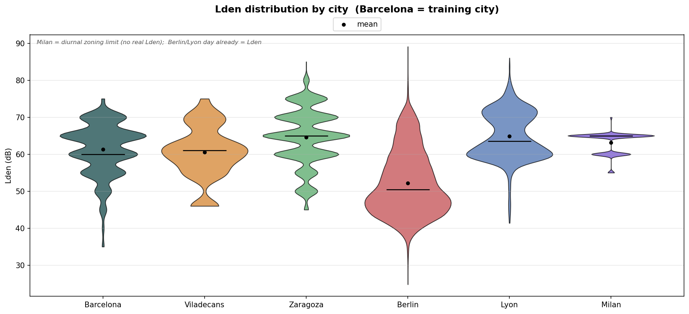
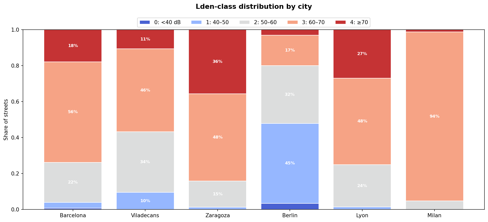
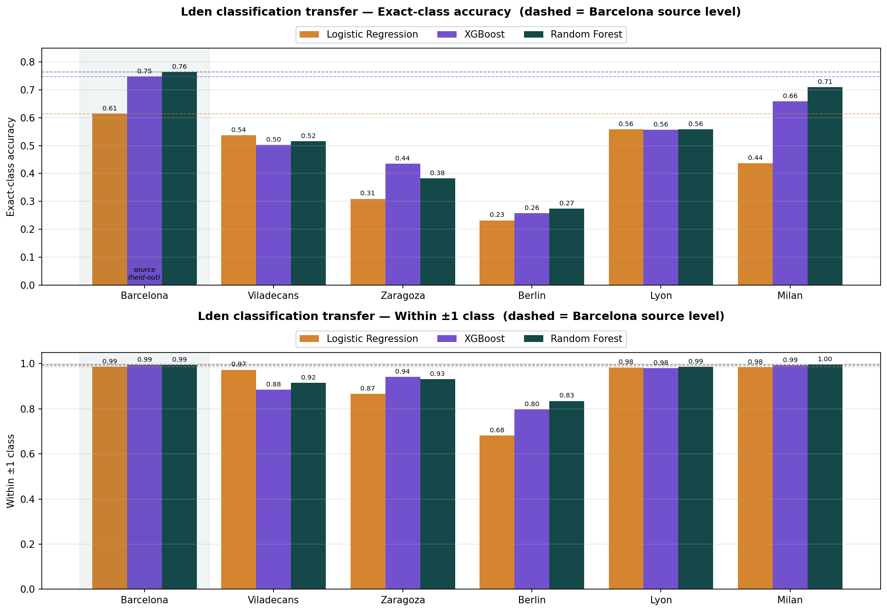
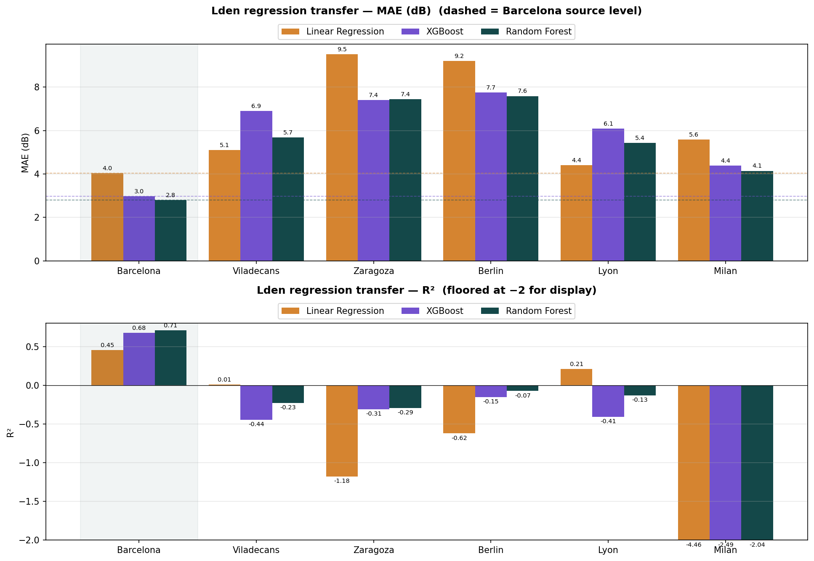

# Testing the Barcelona-trained noise models on other cities — Lden target

**Date:** 2026-06-14
**Target:** **Lden** — the EU day-evening-night composite noise indicator (penalizes evening +5 dB, night
+10 dB), taken from each city's **native published source** (not recomputed from binned day/evening/night).
**Models:** classification (LogReg, XGBoost, RF) on the Lden class and regression (LinReg, XGBoost, RF) on
Lden dB — trained on Barcelona, tested on every city. Same 18 features as the `noise_day` study.
**Notebooks:** `deployment/lden_study/notebooks/{00_build_lden_targets, 01_BCN_train_lden, 02_test_all_cities_lden}.ipynb`.

This reproduces `deployment/BCN_MODEL_TRANSFER_REPORT.md` with Lden as the target. Noise classes are the
same bins: `0: <40 dB, 1: 40–50, 2: 50–60, 3: 60–70, 4: ≥70`.

## Where each city's Lden comes from (native source — verified)

| City | Lden source | Mean Lden | Note |
|---|---|---|---|
| Barcelona | `TOTAL_DEN` in `BCN_noise_streets.gpkg` (range strings → lower bound) | 61.2 dB | real Lden, +1.6 dB above Lday |
| Viladecans | `TOTDEN` in the agglomeration noise geojson | 60.5 dB | real Lden, +0.6 dB above Lday |
| Berlin | `GES_DEN_mean` — **already** the dataset's `noise_day` | 52.2 dB | Berlin's "day" *is* the agency Lden |
| Lyon | Lden raster (`GL_Rte_Lden.tif`) — **already** the dataset's `noise_day` | 64.9 dB | Lyon's "day" *is* the Lden raster |
| Zaragoza | `mapa_ruido_DEN_2016` WFS isophones (`DB_HI − 5`) | 64.5 dB | real Lden, +0.4 dB above Lday |
| Milan | **no Lden published** → diurnal acoustic-zoning limit used as a **flagged proxy** | 63.1 dB | *not a real Lden* |

**Why native, not recomputed:** recomputing Lden from the stored day/evening/night fails because most cities
store 5-dB lower-bound bins — Barcelona's published `TOTAL_DEN` disagrees with the formula-on-bins by up to a
class. So the published `*_DEN` field is read directly (re-joining it to the segments for Barcelona,
Viladecans and Zaragoza; Berlin and Lyon already carry it as their day value; Milan has none).

---

## Results — classification (Lden class, accuracy)

| Model | Barcelona (held-out) | Viladecans | Milan | Berlin | Lyon | Zaragoza |
|---|---|---|---|---|---|---|
| Logistic Regression | 0.614 | **0.537** | 0.437 | 0.232 | **0.559** | 0.309 |
| XGBoost | 0.748 | 0.503 | 0.659 | 0.258 | 0.557 | **0.436** |
| Random Forest | **0.764** | 0.515 | **0.710** | **0.273** | **0.559** | 0.383 |

Within ±1 class stays high everywhere (Berlin ~0.74, all others 0.93–0.99), so the noise *gradient* still
transfers. RF mean signed class error: Barcelona 0.0, Viladecans +0.13, Milan −0.16, Berlin **+0.78**,
Lyon −0.07, Zaragoza −0.52.

## Results — regression (Lden dB)

| Model | metric | Barcelona | Viladecans | Milan | Berlin | Lyon | Zaragoza |
|---|---|---|---|---|---|---|---|
| Random Forest | R² | **0.708** | −0.23 | −2.04 | −0.07 | −0.13 | −0.29 |
| Random Forest | MAE dB | **2.80** | 5.69 | 4.15 | 7.59 | 5.43 | 7.44 |
| Linear Regression | R² | 0.453 | **0.01** | −4.46 | −0.62 | **0.21** | −1.18 |
| XGBoost | R² | 0.679 | −0.44 | −2.49 | −0.15 | −0.41 | −0.31 |

RF mean signed bias (predicted − real, dB): Barcelona −0.2, Viladecans −2.1, Milan −3.1, Berlin **+5.1**,
Lyon −4.3, Zaragoza −5.9. As with `noise_day`, R² is positive only on Barcelona; out-of-domain the MAE and
bias are the meaningful numbers.

## Lden class distribution per city

| Class | Barcelona | Viladecans | Milan | Berlin | Lyon | Zaragoza |
|---|---|---|---|---|---|---|
| 0 (<40) | 1% | 0% | 0% | 3% | 0% | 0% |
| 1 (40–50) | 3% | 10% | 0% | **45%** | 1% | 1% |
| 2 (50–60) | 23% | 34% | 5% | 32% | 24% | 15% |
| 3 (60–70) | **53%** | **46%** | **94%** | 17% | **48%** | **48%** |
| 4 (≥70) | 20% | 11% | 1% | 3% | **27%** | **36%** |

Versus `noise_day`, the Lden distributions shift **louder** (Barcelona class 4: 12% → 20%) because Lden adds
the evening/night penalties — confirming the targets are genuinely the composite indicator.

---

## Diagrams

*Barcelona (shaded) is the held-out source; dashed lines carry its per-model level across each chart. Palette
and layout match the ablation study; legends sit above each plot.*

## Interpretation

- **The transfer behaves exactly like the `noise_day` study** — same 18 features, so the same covariate shift
  drives it. Milan stays in-distribution and scores highest on exact accuracy (RF 0.71); Berlin and Zaragoza
  fall furthest; within-±1 stays high everywhere.
- **Berlin and Lyon are a consistency check.** Their published "day" already *is* Lden, so their Lden numbers
  match their `noise_day`-study numbers (Berlin RF 0.27 ≈ 0.30; Lyon RF 0.56 ≈ 0.53). The Lden re-run did not
  change them, as expected.
- **Berlin is again the hardest** (RF 0.27, +5.1 dB / +0.78-class overestimation): its Lden distribution is
  genuinely the quietest (mean 52.2 dB, 45% in class 1), so the Barcelona model — biased toward its own
  louder 53%-class-3 prior — overpredicts. This is **label shift**, not a feature problem.
- **Viladecans and Zaragoza** carry a real, distinct Lden and transfer moderately (RF 0.52 / 0.38 exact,
  within ±1 ≈ 0.93–0.97), with a mild-to-strong underestimation bias (−2 to −6 dB) — the same pattern the
  `noise_day` study showed for these scale-distorted cities.
- **Milan's regression R² is meaningless here** (−2 to −4.5): its "Lden" is the diurnal **zoning legal limit**
  (no real Lden, 94% one class), so there is almost no variance to explain. Its high *accuracy* only reflects
  predicting the dominant class. Treat Milan's Lden numbers as illustrative, not a true Lden evaluation.

## Caveats

- **Milan has no published Lden.** Its data is acoustic-zoning legal limits (day/night only); the diurnal
  limit is used as a flagged stand-in at the user's request. It is not a real Lden and its regression metrics
  should be disregarded.
- **Berlin / Lyon "day" already equals Lden** in the source, so for them this study and the `noise_day` study
  evaluate the same target.
- **Barcelona / Zaragoza Lden are 5-dB-binned** (lower bounds), like their day values; Viladecans/Berlin/Lyon
  Lden are finer-grained. The transfer comparison is still apples-to-apples (same target definition per city).
- Same `data-encoding` env pickles (sklearn 1.8.0 / xgboost 3.x); `models/*_lden.pkl`.

## Conclusion

Using each city's **real published Lden** (not a fabricated composite), the Barcelona model transfers to the
Lden indicator with the same strengths and limits as the `noise_day` study: the noise gradient transfers
everywhere (high within-±1), exact accuracy degrades with covariate/label shift, and Berlin's genuinely
quieter Lden distribution makes it the hardest target. The covariate-shift remedy demonstrated in
[`scale_invariant/`](../../scale_invariant/SCALE_INVARIANT_REPORT.md) would apply unchanged here, since the
features — not the target — drive the transfer gap.

*Numbers from `results/lden_transfer_comparison_{class,regre}.csv`; per-city predictions in
`results/<xxx>_lden_predictions_*.csv`; native Lden targets in `results/<xxx>_lden.csv`.*
