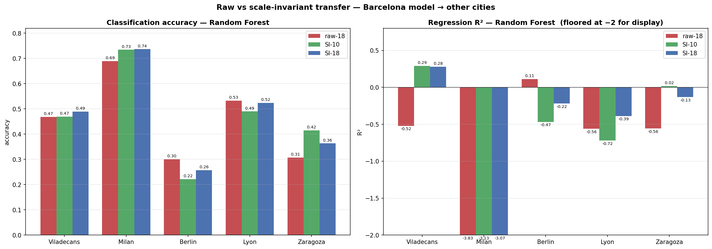

# Scale-invariant transfer — percentile-ranked network features

**Date:** 2026-06-13
**Notebooks:** `scale_invariant/notebooks/01_BCN_train_scale_invariant.ipynb` (train), `02_test_all_cities_scale_invariant.ipynb` (test all cities)
**Models:** `scale_invariant/models/*_si.pkl` (SI-10) and `*_si18.pkl` (SI-18), Barcelona-trained.

## Why

The [ablation study](../ablation_study/ABLATION_STUDY_REPORT.md) showed Barcelona's noise signal lives almost
entirely in the 10 **network** features (6 `dist_to_*` + 4 centralities) — but the
[transfer study](../deployment/BCN_MODEL_TRANSFER_REPORT.md) showed those are exactly the features that go
**out-of-distribution** across cities, because their raw values depend on network size / urban fabric
(closeness shrinks as a network grows; `dist_to_trunk` explodes in big cities). This is **covariate shift**.
This experiment implements the transfer report's recommended fix — **make the network features scale-invariant
by per-city percentile-rank normalization** — and tests two variants against the original model.

## The three models compared

| Variant | Features | Network features |
|---|---|---|
| **raw-18** | all 18, raw | raw (the original deployed model) |
| **SI-10** | the 10 network features only | percentile-ranked |
| **SI-18** | **all 18** | the 10 network features percentile-ranked, the 8 **local** features raw |

The 8 local features (`road_category, width, signals, transport, pois, green, industrial, commercial`) are
already roughly city-comparable (a road-class code, width in metres, point densities, land-use percentages),
so only the network features need normalizing — **SI-18** is the natural "keep everything, just fix the
network features" model.

## How the scale-invariant features are built

For each city independently, and each network feature `f`:

```python
df[f + '_pct'] = df[f].rank(pct=True)     # per-city percentile: fraction of the city's streets with value ≤ this one
```

`rank(pct=True)` replaces the raw value with its **percentile position within its own city** (empirical CDF,
range (0,1], ties averaged) — dimensionless and city-relative: *"this street is in the 90th percentile of
closeness for its city"* means the same thing in Barcelona, Berlin or Zaragoza regardless of absolute scale.
**No geospatial recomputation** — the raw columns already exist in every city's dataset CSV, so this is pure
pandas (no momepy reruns).

Because percentile rank is **monotonic**, it changes nothing for the tree models *within* a single city — so
SI-18 should reproduce the original full-18 model on Barcelona, and SI-10 the ablation's raw
`only-distances+centrality`. The entire effect is on **transfer**.

## Barcelona held-out — the transforms preserve the signal

| Task / metric (RF) | full-18 (raw) | SI-10 | SI-18 |
|---|---|---|---|
| Classification accuracy | 0.749 | 0.748 | **0.746** |
| Regression R² | 0.704 | 0.694 | **0.703** |

SI-18's tree models reproduce the full-18 model (monotonic transform); SI-10 matches the raw
`only-dist+centr` ablation (RF 0.751 / 0.696). The **linear models improve** under both (LogReg 0.606→0.627,
LinReg R² 0.461→0.480 for SI-18), because percentile ranks linearise the skewed raw distances. So neither
transform costs anything on Barcelona — any change on the other cities is pure transfer effect.

## Transfer results (Random Forest) — raw-18 vs SI-10 vs SI-18

raw-18 reproduces the published deployment transfer numbers exactly.

### Classification — accuracy

| City | raw-18 | SI-10 | SI-18 | best |
|---|---|---|---|---|
| Viladecans | 0.469 | 0.469 | **0.490** | SI-18 |
| Milan | 0.690 | 0.734 | **0.737** | SI-18 |
| Berlin | **0.301** | 0.222 | 0.257 | raw |
| Lyon | **0.533** | 0.490 | 0.524 | raw≈SI-18 |
| Zaragoza | 0.307 | **0.415** | 0.363 | SI-10 |

### Regression — R² and MAE (dB)

| City | R² raw-18 | R² SI-10 | R² SI-18 | MAE raw-18 | MAE SI-10 | MAE SI-18 |
|---|---|---|---|---|---|---|
| Viladecans | −0.52 | **+0.29** | +0.28 | 6.08 | **4.40** | **4.40** |
| Milan | −3.83 | −3.13 | **−3.07** | 5.41 | **4.56** | 4.62 |
| Berlin | **+0.11** | −0.47 | −0.22 | **6.89** | 8.85 | 8.04 |
| Lyon | −0.56 | −0.72 | **−0.39** | 6.50 | 6.64 | **6.09** |
| Zaragoza | −0.56 | **+0.02** | −0.13 | 8.53 | **6.47** | 7.08 |

(Full numbers for all three models in `results/si_transfer_comparison_{class,regre}.csv`.)



## Interpretation

The three variants separate the cities by **what was actually wrong** with their transfer, and SI-18 emerges
as the most robust general-purpose model.

**Covariate-shift cities → both SI variants win big.**
- **Viladecans** (raw closeness 22σ): R² −0.52 → +0.28/+0.29, MAE 6.08 → 4.40 dB, bias −3.6 → −0.8 dB. SI-18
  even edges classification (0.49 vs 0.47).
- **Zaragoza** (raw `dist_to_tertiary` 4.7σ): R² −0.56 → +0.02 (SI-10) / −0.13 (SI-18), MAE down ~1.5–2 dB,
  accuracy +0.06–0.11. Here pure **SI-10 is best** — the local features add a little noise that SI-18 carries.

**Label-shift / label-definition cities → SI-18 is the safe choice, SI-10 is fragile.**
- **Berlin**'s failure is label shift (a genuinely quieter city), not covariate shift, so normalizing the
  features makes the model predict *louder* and **SI-10 collapses** (acc 0.30→0.22, R² +0.11→−0.47). **SI-18
  recovers about half of that damage** (acc 0.26, R² −0.22, MAE 8.04 vs 8.85) because the raw local features
  anchor the prediction — but raw-18 is still best for Berlin. No feature normalization fixes a different
  noise distribution.
- **Lyon** is the clearest SI-18 win: it is the **best of all three on regression** (R² −0.39 vs −0.56 raw /
  −0.72 SI-10; MAE 6.09, the lowest) and ties raw on accuracy. Lyon (Barcelona-sized commune) had little
  covariate shift, so SI-10's aggressive renormalization hurt — but SI-18 keeps the local features and lets
  the mild network correction help.
- **Milan**: classification improves for both SI variants (0.69 → 0.74); regression R² stays deeply negative
  because Milan's target is acoustic-zoning **legal limits**, untouchable by feature normalization.

**SI-18 is the robust middle ground.** It reproduces the full model on Barcelona, captures almost all of
SI-10's gains on the scale-distorted cities (Viladecans, Milan), wins Lyon outright, and — crucially — never
suffers SI-10's Berlin-style collapse, because the retained raw local features act as a safety net when the
network renormalization over-corrects. SI-10 is marginally better only on the two purest covariate-shift cases
(Viladecans regression by 0.01 R², Zaragoza), at the cost of fragility everywhere else.

## Conclusion

- **Scale-invariance fixes covariate shift but not label shift.** It converts the scale-distorted cities
  (Viladecans, Zaragoza) from unusable (negative R²) to usable, with no cost on Barcelona — exactly the cities
  the σ-analysis flagged, which confirms the diagnosis.
- **Recommended deployable model: SI-18** — all 18 features with the network features percentile-ranked. It
  dominates raw-18 on 4 of 5 cities (loses only Berlin), matches the full model on Barcelona, and avoids the
  downside risk of the pure SI-10 model. Use **SI-10** only when the target city is known to differ from
  Barcelona mainly in size/fabric (a small/medium city with true modeled-dB labels).
- **Berlin-type label shift still needs target-side calibration** (a few hundred labeled target segments, or
  target harmonization) — no feature transform alone will close it.

*Numbers from `results/si_transfer_comparison_{class,regre}.csv`; per-city SI-18 predictions and RF dB-error
maps in `results/<xxx>_si18_predictions_*.csv` and `results/<xxx>_si18_map_db_diff_rf.html`.*
